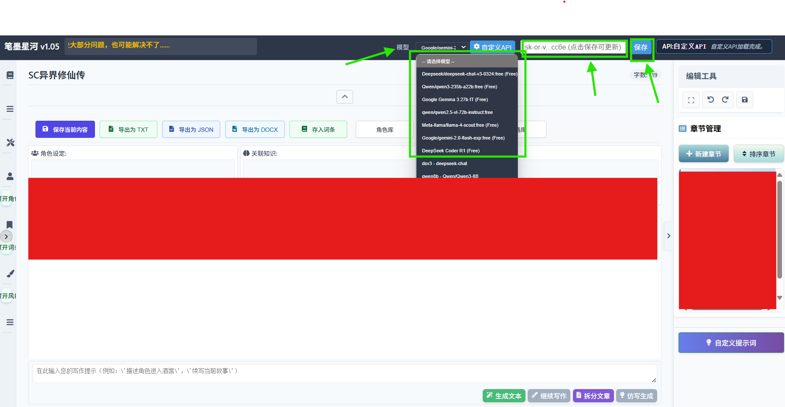

# API 基本信息

**注:你可直接查看最下方的 免配置 一栏**

|配置项|说明|
|--|--|
|API 名称|openrouter API|
|API 基础 URL|`https://api.openrouter.ai/v1`|
|官方文档|[openrouter 平台](https://openrouter.ai/)|
|API 路径|`chat/completions`|
|API 密钥|请登录平台自行查看|
|模型名称|模型名字为Models中的完整名字,如`deepseek/deepseek-r1-0528:free`,请参考官方文档选择合适模型|
|其他|有许多免费模型|

## 快速开始

### 获取API密钥

1. 登录 [openrouter 平台](https://platform.openrouter.ai/)
2. 进入「[API keys](https://openrouter.ai/settings/keys)」管理页面
3. 创建或复制您的API密钥

### 免配置

由于本软件内置了OpenRouter的api选项,所以你不需要使用自定义模型中配置OpenRouter Api  
你可在最上端模型那一栏选择模型,然后在右侧输入框中输入api key并点击保存  
图示:
